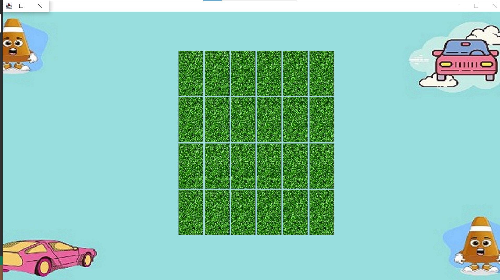
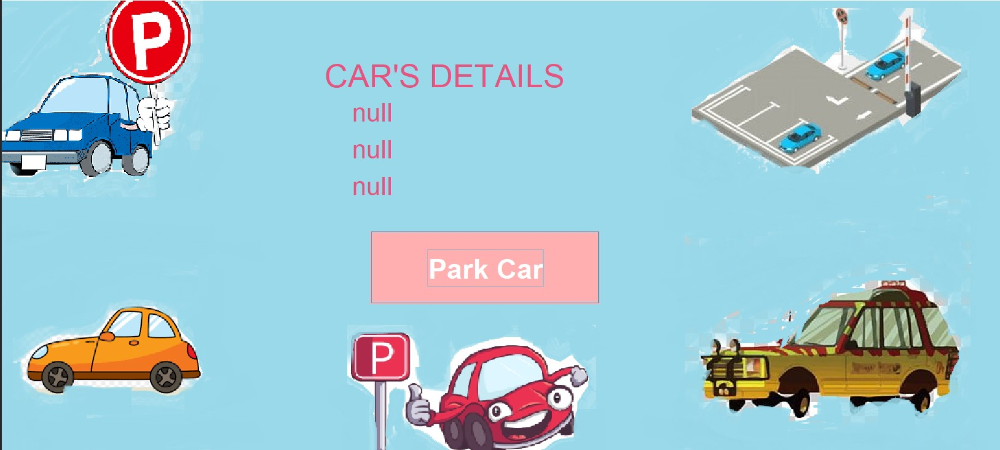
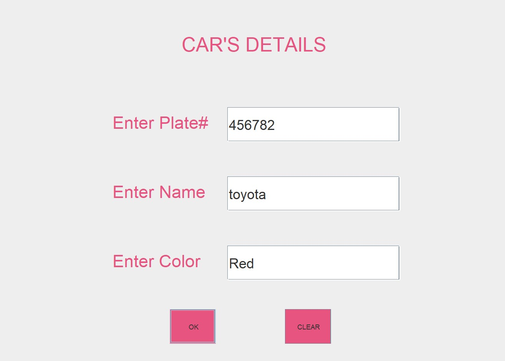
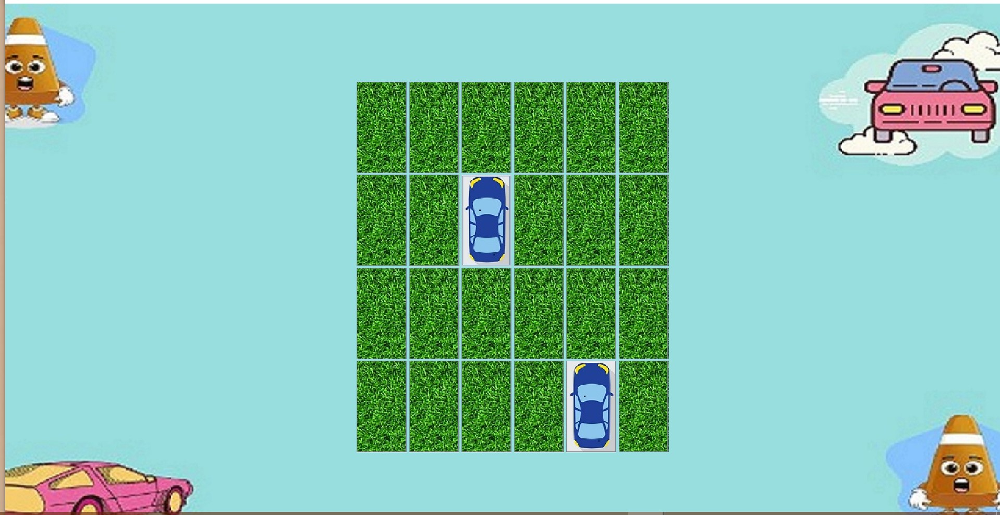
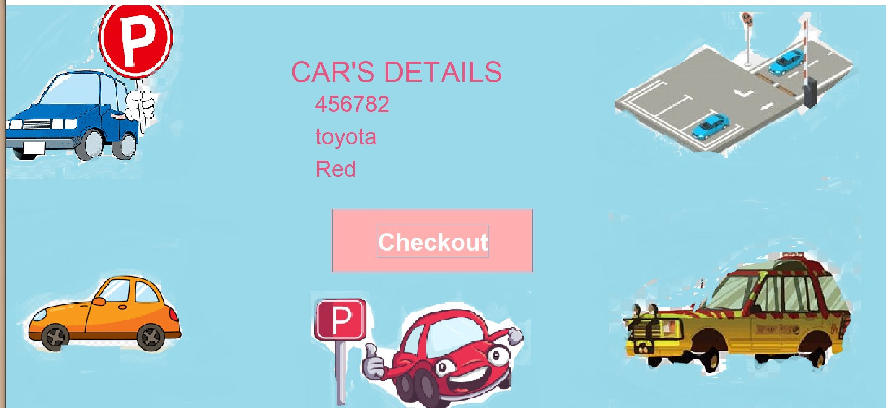
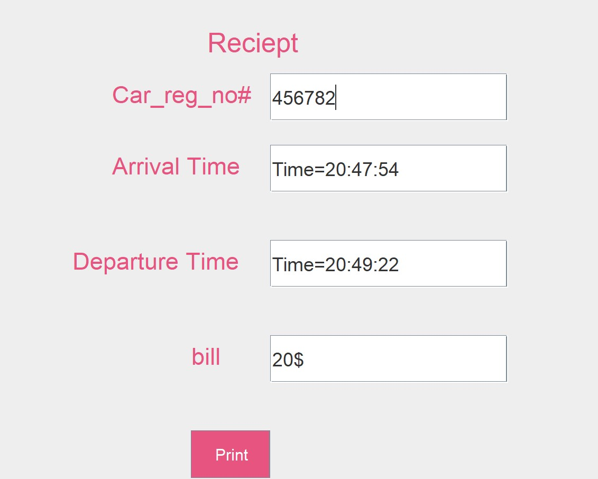

# Car Parking System

Welcome to the Car Parking System! This Java application provides a user-friendly interface for managing a parking lot. Users can park their cars, check out, and generate receipts seamlessly.

## Features

- **Interactive GUI**: The system offers an intuitive graphical user interface for users to interact with.
- **Park Car**: Users can park their cars by clicking on available parking slots.
- **Checkout**: When checking out, users can generate a receipt displaying car details, arrival and departure times, and total bill.
- **Easy Setup**: Simply run the application to start managing your parking lot.

## Requirements

- Java Development Kit (JDK)
- Any Java IDE (e.g., Eclipse, IntelliJ IDEA) or text editor (e.g., Visual Studio Code)

## Installation

1. Clone this repository to your local machine:

    ```bash
    git clone https://github.com/your_username/car-parking-system.git
    ```

2. Open the project in your Java IDE or text editor.

3. Compile and run the `ParkingLot.java` file to start the application.

## Usage

1. Launch the application by running the `ParkingLot.java` file.

2. Click on available parking slots to park your car.

3. To check out, click on the occupied parking slot and follow the prompts to generate a receipt.

4. Enjoy hassle-free parking management with the Car Parking System!

## Screenshots







<!-- Add more screenshots as needed -->

## Contributing

Contributions are welcome! If you have any suggestions, bug reports, or feature requests, please open an issue or submit a pull request.

## License

This project is licensed under the MIT License.
